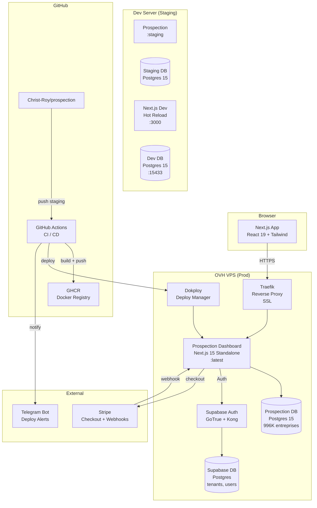

# Architecture — Veridian Prospection

## Vue d'ensemble



## Stack technique

| Composant | Technologie | Version |
|-----------|-------------|---------|
| Frontend | Next.js (App Router) | 15.3.3 |
| UI | Tailwind CSS + shadcn/ui | v4 |
| ORM | Prisma | 6.19.2 |
| DB | PostgreSQL | 15 |
| Auth | Supabase (GoTrue) | Self-hosted |
| Deploy | Dokploy + Docker | Latest |
| CI/CD | GitHub Actions | — |
| E2E | Playwright | Multi-browser |
| Monitoring | Custom /api/status + Telegram | — |

## Base de donnees

### Table principale : `entreprises` (996K rows, 107 colonnes)
- Identite SIRENE (siren, denomination, NAF, forme juridique)
- Contact (best_phone_e164, best_email_normalized)
- Web (web_domain, web_domains_all JSONB, tech_score)
- Finances (chiffre_affaires, resultat_net, marge_ebe)
- INPI v3.6 (ca_last, ca_trend_3y, profitability_tag, deficit_2y)
- Certifications (est_rge, est_qualiopi, est_bio, est_epv)
- Scoring (prospect_score 0-100, prospect_tier, small_biz_score)

### Tables operationnelles
- `outreach` (PK: siren + tenant_id) — pipeline commercial
- `workspaces` + `workspace_members` — multi-tenant multi-user
- `invitations` — magic link invite flow
- `inpi_history` (PK: siren + annee) — historique financier
- `pipeline_config` — settings par tenant

## URLs

| Env | URL | Role |
|-----|-----|------|
| Prod | prospection.app.veridian.site | SaaS live |
| Staging HTTPS | saas-prospection.staging.veridian.site | CI e2e target |
| Dev Tailscale | 100.92.215.42:3000 | Hot reload dev |
| Supabase Prod | api.app.veridian.site | Auth + tenants |
| Hub | app.veridian.site | Central hub |

## CI/CD Pipeline

```
staging push → unit (tsc+eslint+vitest, 1min)
  → build (next build, 2min)
  → integration (prisma+postgres, 1min)
  → docker-staging (build+push :staging, 3min)
  → deploy-staging (Dokploy redeploy, 30s)
  → e2e-staging (Playwright 3 blocking + 17 non-blocking, 8min)
  → promote-to-main (ff-only merge, 6s)

main push → docker (build+push :latest, 3min)
  → deploy-prod (pull+redeploy, 30s)
  → e2e-prod (login-only smoke, 2min)
  → rollback-prod (if e2e fails)
  → telegram notify
```
